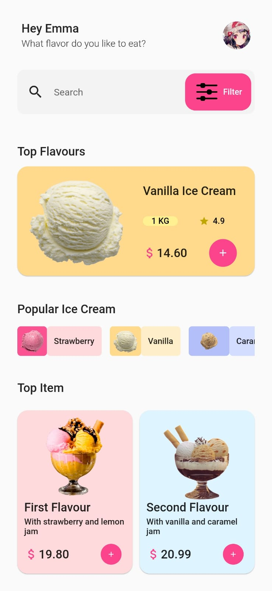
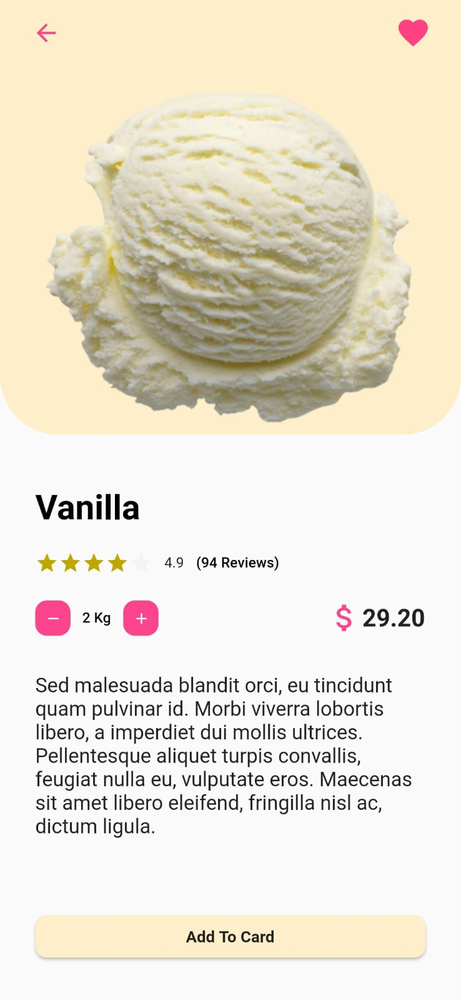
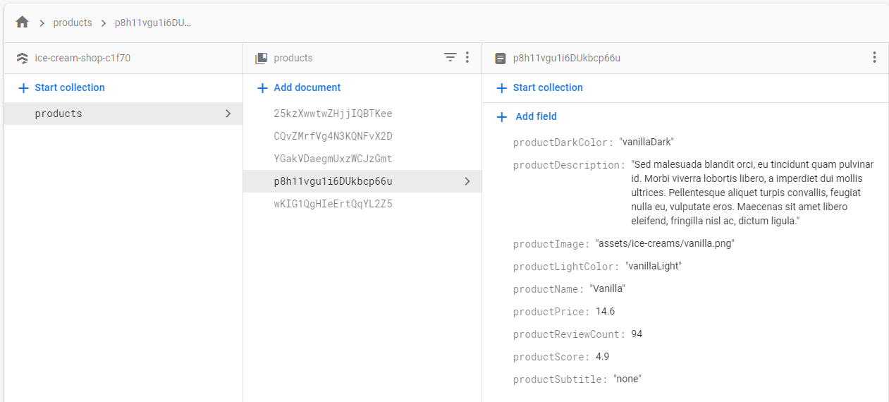

<h1 align="center"> Ice Cream Shop </h1>

* This project has two screens.
* GUI for the project is taken from [this](https://www.uplabs.com/posts/ice-cream-shop-mobile-app-867709e9-2a2c-4634-ab88-e513fb0ef21d) site 
* Home Screen designed with dummy datas
* Product (second screen) implemented using the data from Firestore Cloud
* Please try project with Android Devices. Because I didn't initialized Firestore Cloud for ios, web and desktop platforms.

<h2 align="center"> Home Screen </h2>

  

<h2 align="center"> Product Screen </h2>

  

<h2 align="center"> Firestore Cloud </h2>

  

